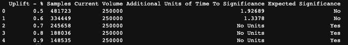

# Power analaysis for a/b testing ratios/proportions using MDE (Minimal Detectable Effect) 
Using minimal detectable effect for frequentist power calculations in a/b testing. The script can run directly in the terminal where the required arguments are: 

1. p1: The benchmark ratio 
2. min_size: lower limit of evaluation the uplift evaluation grid
3. max_size: upper limit of evaluation the uplift evaluation grid
4. volume: Number of observations (data) per unit of time. 

Terminal output can look something like this: 

Here you can see that  